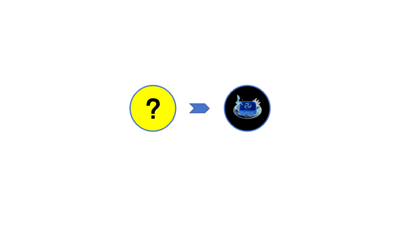

# Bad Cusine

如果一个成品菜肴继续被*烹饪*,他会烤糊并最终变成失败料理. 请注意不要让菜肴糊了噢!

If a finished dish continues to be *cooked*, it will burn and eventually become a failure. Please be careful not to burn the dishes!

请更不要将失败料理交给你的宝享用,除非你恨她入骨!

Please do not give your failure to your customer, unless you hate her!

|Icon       |Name        | Recipe|
|-----------|------------|------|
| | Bad Cusine | |

