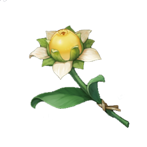
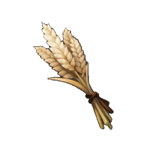
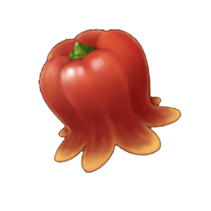
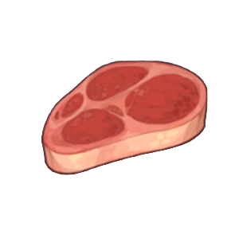
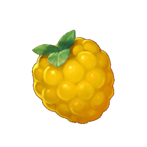
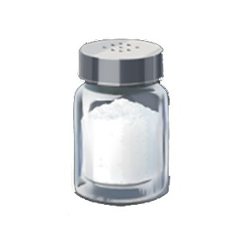

# Basic Item

基础物资, 可以从*原味货箱*中直接获取.

Basic items can be obtained directly from the *Storage Crates*.

对了,请不要尝试将基础物资直接交给你的宝享用,他不会吃的,只会十分恨你.

By the way, please do not try to give basic item directly to your treasure to enjoy, she will not eat, and will only hate you.

|Icon       |Name        || Icon | Name
|-----------|------------||------|-------|
| | Sweet Flower ||  | Wheats |
| | Jueyun Chili ||  | Raw Meat |
| | Berry ||  | Salt |

