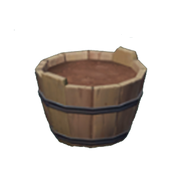

# Trash Bin 垃圾桶
*风带来了故事的种子，时间使之发芽。*

所有被放入垃圾桶的东西都会被快速销毁！

Everything placed in the garbage bin will be quickly destroyed! 

理论上，你可以抢在食物被销毁前立刻将其取出，但做这种事情真的很无聊orz

In theory, you could grab food before it's destroyed, but it's really boring :D

|Operation|Description|
|--------|-------------------------------|
|Put     | If you have food ingredients in your hand, put them in the garbage bin; otherwise, it is **illegal**. |
|Get     | (Not recommended) If there are ingredients in it, take them; otherwise, it is **illegal**. |
|Interact| No action. |
|Throw   | If you have food ingredients in your hand, throw them into the garbage bin. |

