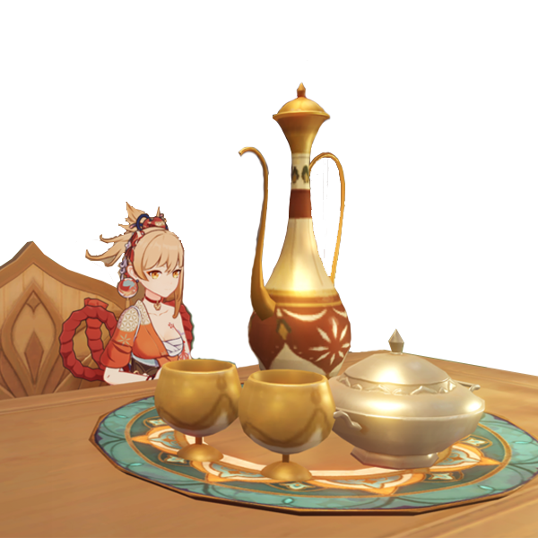

# Customer 你的崽
*风带来了故事的种子，时间使之发芽。*

将成品菜肴交给你的崽，它会吃的很开心。
喂养它三道菜肴，你就完成一轮厨房之旅了~

Hand over the finished dishes to your customer, and it will be very happy. Feed it three dishes, and you will complete one round of the kitchen journey~

|Operation|Description|
|--------|-------------------------------|
|Put     | If you have a dish in your hand, give it to your customer. Note that your customer will only eat finished dishes. Please do not feed it Jueyun Chili~ |
|Get     | No action. |
|Interact| No action. |
|Throw   | **Illegal operation.** |

