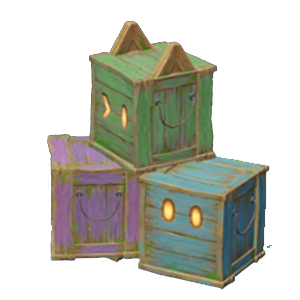

# Storage Crate 「原」味货箱
*什么？货箱里的货是哪来的？当然是纯水精灵喊出“启动”后变的~*

只要「原」味货箱的存储没满，就地会源源不断自动补充基础食材。
补充速度较慢，派蒙建议一次性多取出一点呦～

As long as the storage crate isn't full, basic food ingredients will be continuously and automatically replenished. The replenishment speed is relatively slow, so Paimon suggests taking out a little more at once~

|Operation|Description|
|--------|-------------------------------|
|Put     | No action. |
|Get     | Get one of the basic food ingredients. |
|Interact| No action. |
|Throw   | **Illegal operation.** |

