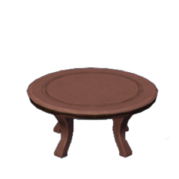

# Table 桌子
*蜃境管理者伊迪娅提醒您：千万不要尝试往一个已经放满食材的桌子继续丢食材噢！*

桌子可以用于存放与取出若干物品。
此外，桌子是*"丢食物"*操作的唯二合法目标(另一个是垃圾桶)。

The table can be used to store and retrieve various items.
The table is one of the valid target for the *"throw"* operation.

|Operation|Description|
|--------|-------------------------------|
|Put     | As long as the table's capacity is not full (up to 3 items), store the items you have in your hands on the table. |
|Get     | Take one item from the table. If there are multiple items on the table, you will only be able to take the item that was most recently stored on the table (following a stack mechanism). |
|Interact| No action. |
|Throw   | Throw the items you have in hands to the table. |

