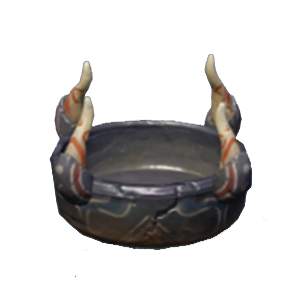
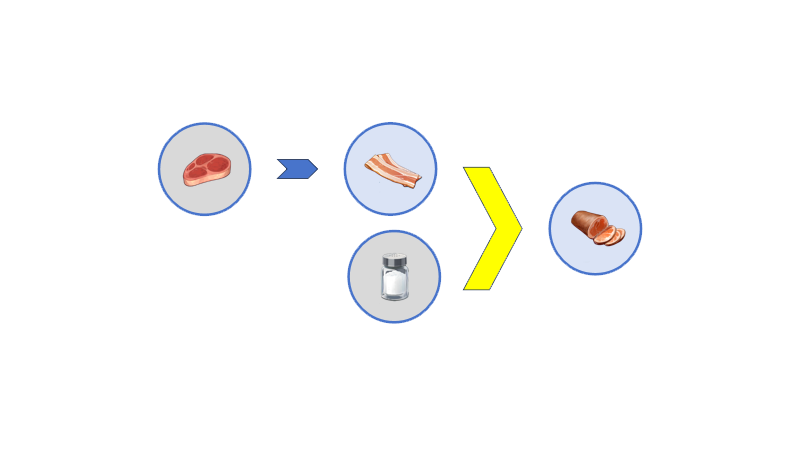

# Combining

*组合*操作能够将**多个**食材处理成另一食材.

*Combining* operations can process **multiple** ingredient into another ingredient.

## *Combining* Machine
以下两种机器能够对食材实施*组合*操作. 对机器的详细介绍, 请参考wiki的Machine部分.

The following two types of machines can perform *combining* operations on food ingredients. Refer to the Machine section of the wiki for a detailed description of the machine.

 

## *Combining* in Recipe

在配方介绍图中,**黄色大箭头**代表组合操作.
例如以下配方代表肉片和盐可以*组合*成火腿.

In the recipe illustration, we use the **big yellow arrow** to represent the combined operation.
For example, the following recipe represents that slices of meat and salt can *combine* to make ham.

