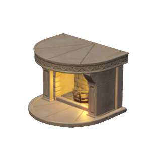
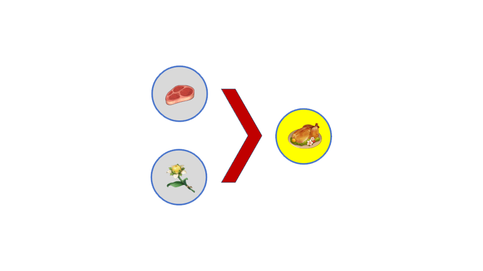

# Cooking

*烹饪*操作能够将**多个**食材处理成**菜肴**,但也可能将**菜肴**烤糊变成黑暗料理.

The *cooking* operation can process **multiple** ingredients into **cusines**, but it may also burn **cusines** into bad cusines.

## *Cooking* Machine
以下两种机器能够对食材实施*烹饪*操作. 对机器的详细介绍, 请参考wiki的Machine部分.

The following two types of machines(Stove/Oven) can perform *cooking* operations on food ingredients. Refer to the Machine section of the wiki for a detailed description of the machine.

 

## *Cooking* in Recipe

在配方介绍图中,**红色大箭头**代表烹饪操作.
例如以下配方代表肉片和甜甜花可以*烹饪*成甜甜花酿鸡.

In the recipe illustration,**large red arrows** represent cooking operations.
For example, the following recipe represents meat slices and sweet flowers can be *cooked* into sweet flowers stuffed chicken.

