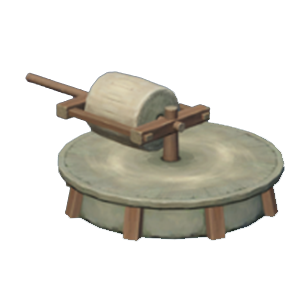
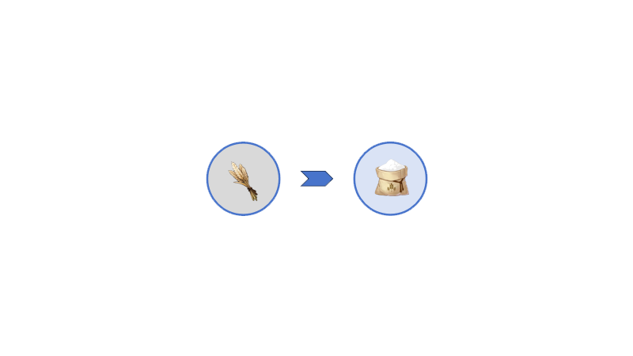

# Processing

*加工*操作能够将**单一的**食材处理成另一食材.

Processing operations can process **a single** ingredient into another ingredient.

## *Processing* Machine
以下两种机器(Stone Mill/Cutting Machine)能够对食材实施*加工*操作. 对机器的详细介绍, 请参考wiki的Machine部分.

The following two types of machines(Stone Mill/Cutting Machine) can perform *processing* operations on food ingredients. Refer to the Machine section of the wiki for a detailed description of the machine.

 

## *Processing* in Recipe

在配方介绍图中,我们用**蓝色箭头**代表加工操作.
例如以下配方代表小麦可以*加工*成面粉.

In the recipe illustration, we use **blue arrows** to represent processing operations. For example, in the following recipe, we *process* wheat into flour:

