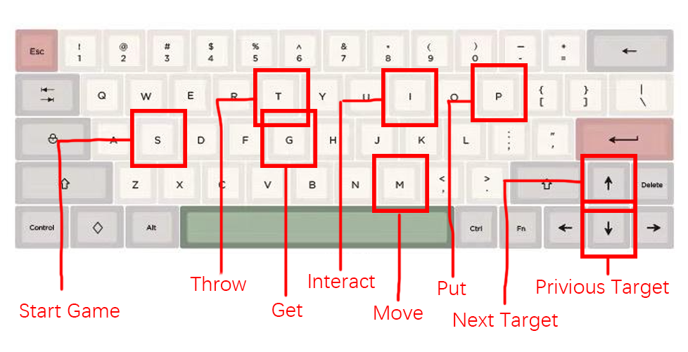

# Try with your Keyboard
为了熟悉厨房里的各项操作,你可以选择使用键盘试玩客户端. 只需要启动客户端,点击"键盘试玩"即可. 

In order to get familiar with the various operations in the kitchen, you can choose to use the keyboard to try out the client.
Just launch the client and click "Keyboard Trial".

在试玩时,键盘操作规则如下图.

In the trial play, the keyboard operation rules are as follows.

# Try the Manual demo

将开发板与电脑连接,烧写QuickStart文件夹中准备的ManualDemo.bit文件到开发板.

Connect the development board to your computer and burn the *ManualDemo.bit* file prepared in the *QuickStart* folder to the development board.

在客户端中选择合适的端口,并设置波特率为9600.

Select an appropriate port on the client and set the baud rate to 9600.

用靠右的5个大开关来控制target, 五个按钮来控制五种操作.

Use five big switches on the right to control target and five buttons to control five operations.

如果测试时,开发板的操作能正常反映到软件中,则测试成功.

If the operation of the development board can be normally reflected in the software during the test, the test is successful.

# Try the Script demo

将开发板与电脑连接,烧写QuickStart文件夹中准备的ScriptDemo.bit文件到开发板.

Connect the development board to your computer and burn the *ScriptDemo.bit* file prepared in the *QuickStart* folder to the development board.

在客户端中选择合适的端口,并设置波特率为9600.

Select an appropriate port on the client and set the baud rate to 9600.

跳过测试, 直接进入厨房. 在厨房中选择"脚本编译",并将准备好的脚本复制粘贴进客户端中.

Skip the test and go straight to the kitchen. Select "Script Compilation" in the kitchen and copy and paste the prepared script into the client.

编译脚本后,点击按钮将脚本加载进开发板,然后回到厨房界面.

After compiling the script, click the button to load the script into the development board and return to the kitchen.

单击开发板上五个按钮中靠左的那个按钮reset脚本执行器, 然后你就可以看到开发板全自动做菜了!

Click the left button of the five buttons on the development board to reset the script executive, and you can see the development board fully automatic cooking!

